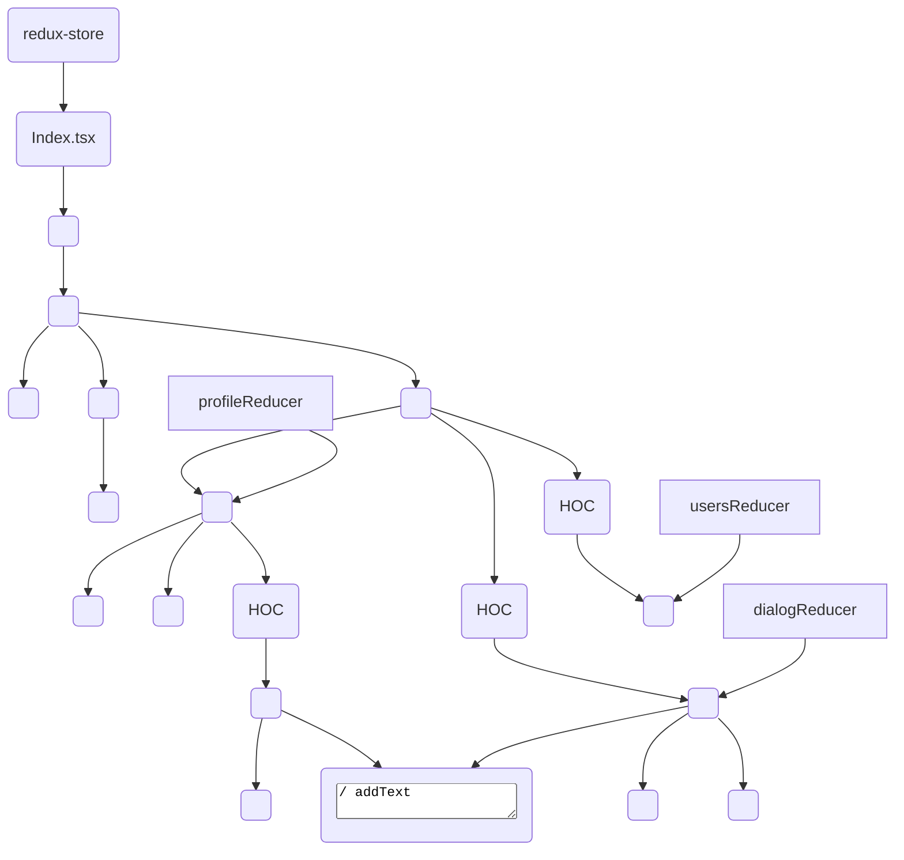

```mermaid
    graph TD;
        Redux(redux-store) --> Index(<Probider> Index.tsx </Provider>);
            Index --> Router(<BrowserRouter />)
                Router --> App(<App />)
                    App --> Header(<Header />) 
                    App --> Navbar(<Navbar />)
                    Navbar --> NavLinks(<NavLinks>)
                    App --> Main(<Main />)
                    Main --> Profile(<Profile />)
                        Profile --> ProfileInfo(<ProfileInfo />)
                        Profile --> ProfilePhoto(<ProfilePhoto />)
                        Profile --> PostsContainer(<PostsContainer />HOC)
                            PostsContainer --> Posts(<Posts />)
                                Posts --> Post(<Post />)
                                Posts --> TextArea(<TextArea />/ addText)
                    Main --> DialogContainer(<DialogContainer />HOC)
                        DialogContainer --> Dialogs(<Dialogs />)
                            Dialogs --> DialogItem(<DialogItem />)
                            Dialogs --> Message(<Message />)
                            Dialogs --> TextArea
                    Main --> UsersContainer(<UsersContainer /> HOC)
                        UsersContainer --> Users(<Users />)
                    dialogReducer --> Dialogs     
                    profileReducer --> Profile 
                    usersReducer --> Users      
        
```